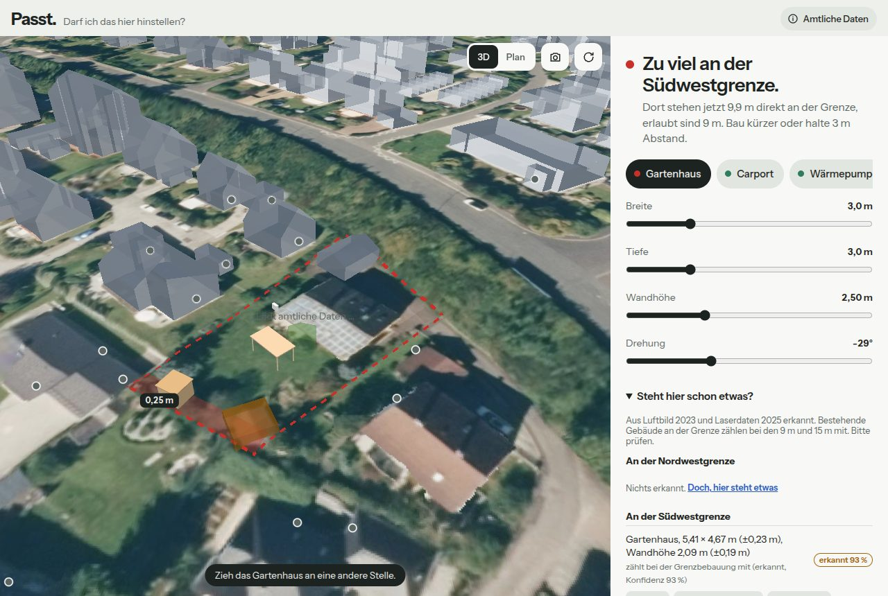
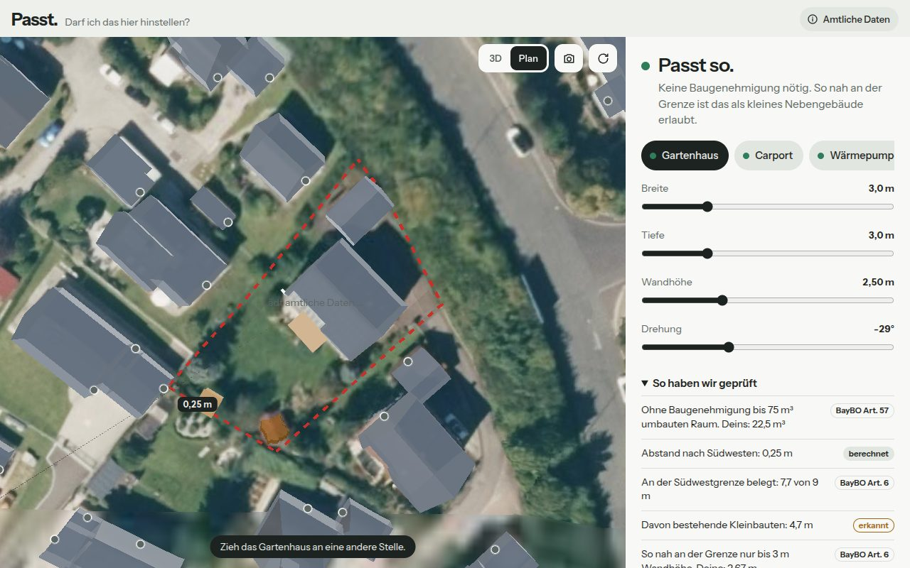
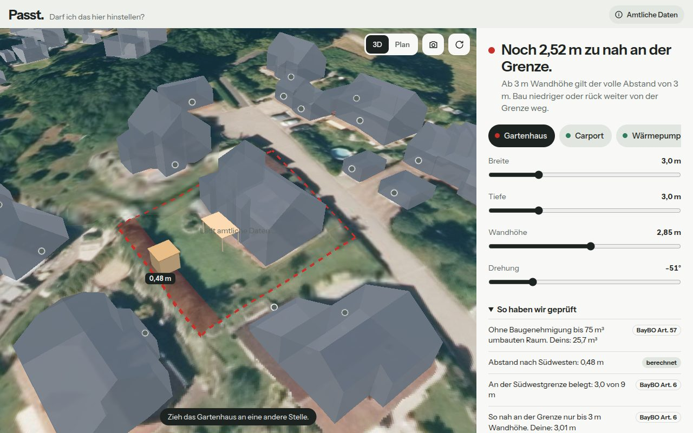
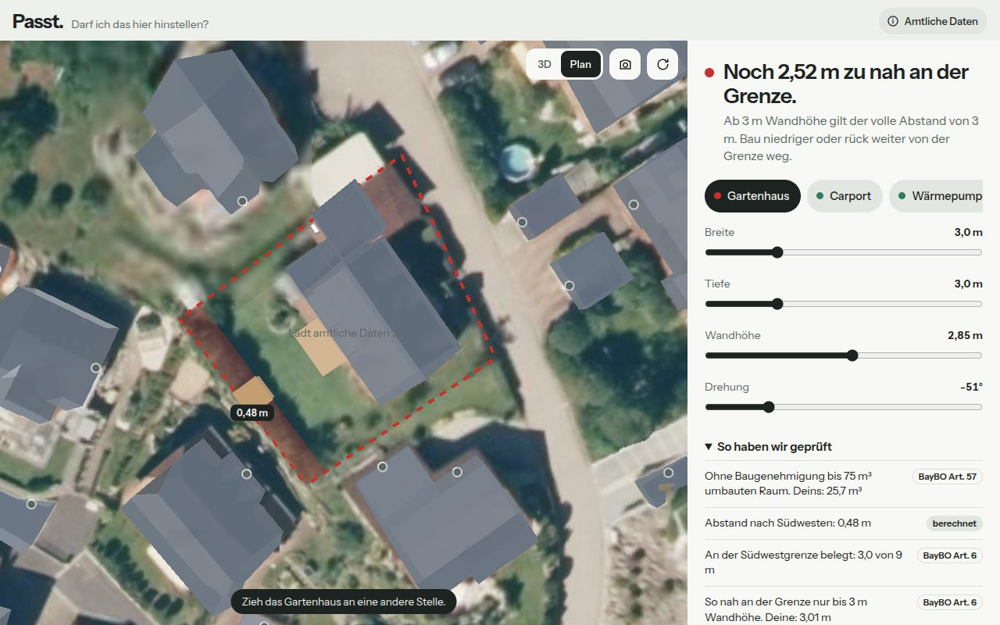
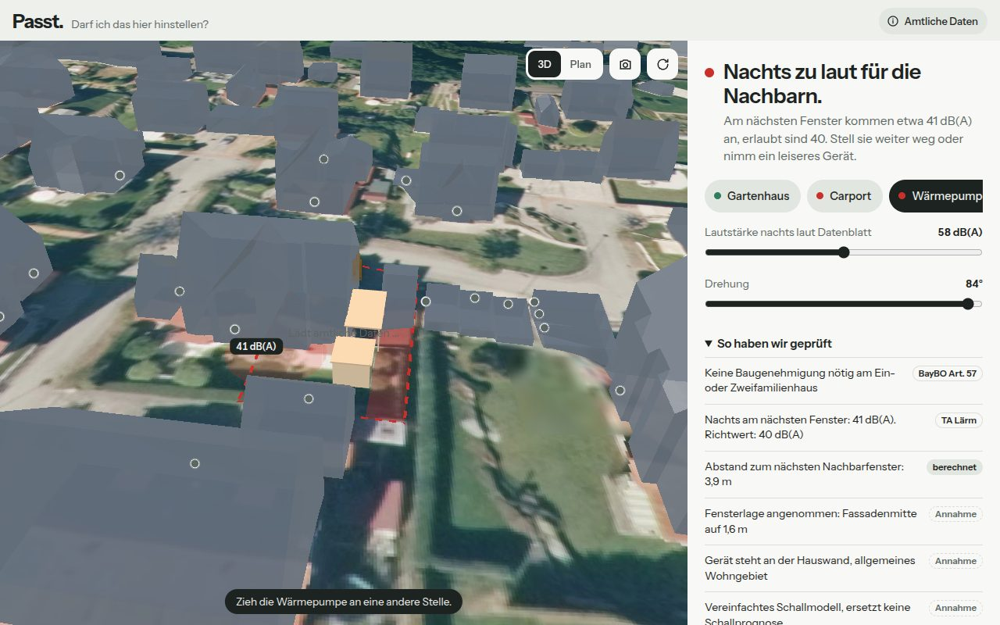
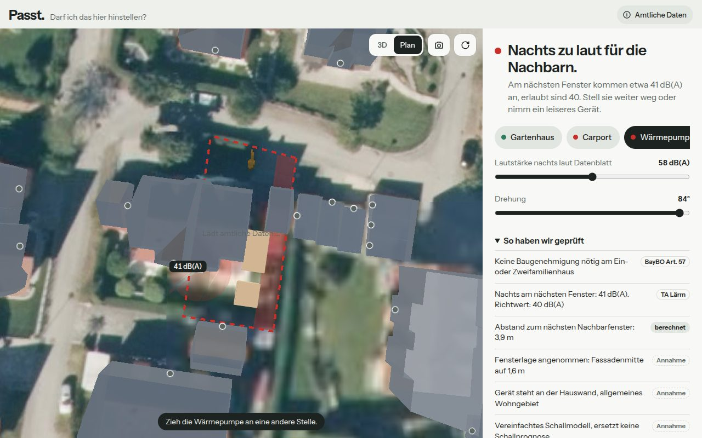
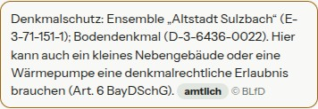

# Demo-Adressen

Drei echte Adressen in Sulzbach-Rosenberg, je mit einer typischen Frage. In der App erscheinen sie auf der Startseite
unter „Demo-Adressen“ (auch offline). Ergebnisse aus `docs/demo/ergebnisse.json`, Stand 3. Oktober 2026; Demo 1 nach der Garten-Erkennung neu durchgespielt am 4. Oktober 2026.

**Wichtig:**
- Die Grenzen sind **nicht amtlich**. Sie sind mit `pipeline/demo_grenze.py` aus der Parzellarkarte abgeleitet und in
  der App als `Demo` gekennzeichnet („Grundstücksgrenze für die Demo nach der Flurkarte nachgezeichnet“).
- Es sind echte Wohnadressen. **Vor einer öffentlichen Demo das Einverständnis der Eigentümer einholen** oder die
  Adresszeile in `pipeline/config.yaml` neutral benennen. Gezeigt werden nur amtliche Geodaten, keine Personendaten.
- Hausnummern sind an der amtlichen Parzellarkarte geprüft. Zuordnung von Koordinate zu Straße per Nominatim, © OpenStreetMap.

## 1. Gartenhaus an der Grenze – Fröschau 41

- Grundstück 906 m². In der Südecke steht bereits ein Gartenpavillon mit Satteldach. Er fehlt in LoD2 und den
  Hausumringen; die Garten-Erkennung (AUFTRAG_V2 Phase 1) findet ihn: **5,41 × 4,67 m (±0,23 m), Wandhöhe 2,09 m
  (±0,19 m)**, Konfidenz 93 %, Umriss aus den Dach-Laserpunkten 2025 (`erkannt`). In Meilenstein 5 war er nur grob
  aus dem DOM geschätzt (4,7 m an der Grenze).
- Start: Gartenhaus 3 × 3 × 2,5 m, 0,25 m von der Südwestgrenze.
- Ergebnis (Stand 4. Oktober 2026): **„Zu viel an der Südwestgrenze.“** – belegt **9,9 von 9 m**, davon **6,9 m
  bestehende Kleinbauten**. Der Pavillon steht in der Ecke und zählt deshalb an zwei Grenzen.
- In der Demo zeigen: unter „Steht hier schon etwas?“ den Pavillon mit „Gibt es nicht“ verwerfen → **„Passt so.“**
  (3,0 von 9 m). Oder „Umriss nachziehen“ → das Objekt wird `nutzerbestätigt` und zählt dann sicher mit.
  So wird klar, warum der Bestand zählt und warum Bestätigen wichtig ist.

## 2. Hanglage – Am Schützenheim 3

- Grundstück 703 m², Gelände fällt von 434 m (Nordwest) auf 431 m (Südwest), DGM1.
- Start: Gartenhaus 3 × 3 m, Wandhöhe **2,85 m**, 0,48 m von der talseitigen Grenze.
- Ergebnis: **„Noch 2,52 m zu nah an der Grenze.“** – über dem Gelände gemessen hat die Grenzwand **3,01 m**
  (Fußboden am höchsten Geländepunkt). Auf ebenem Grund wäre dasselbe Gartenhaus erlaubt.
- In der Demo zeigen: Wandhöhe auf 2,70 m → grün. Oder das Gartenhaus 3 m von der Grenze wegziehen.

## 3. Wärmepumpe nah am Nachbarn – Carl-Orff-Straße 1

- Doppelhaushälfte, Grundstück 346 m², Nachbarhälfte 1a direkt angebaut.
- Start: Wärmepumpe (58 dB(A) nachts laut Datenblatt) an der eigenen Hauswand im Garten, an der Grenze zu 1a.
- Ergebnis: **„Nachts zu laut für die Nachbarn.“** Etwa **41 dB(A)** am nächsten Nachbarfenster in 3,9 m
  (Fenster angenommen: Fassadenmitte, 1,6 m, `Annahme`). Richtwert allgemeines Wohngebiet 40 dB(A).
- In der Demo zeigen: Pumpe 2–3 m nach Osten ziehen → gelb/grün; Gebietsart auf „Mischgebiet“ → 45 dB(A) Richtwert;
  auf die Rückfassade von 1a tippen, um das echte Fenster zu setzen (`nutzerbestätigt`).
- Gefunden beim Durchspielen und behoben: Beim Doppelhaus lag das angenommene Fenster auf der **Brandwand**.
  Fassaden, an die ein anderes Gebäude anschließt, sind jetzt ausgeschlossen (Test in `app/test/plot.test.ts`).

## Denkmal-Hinweis (Altstadt)

Für ein Grundstück am Luitpoldplatz zeigt die App zusätzlich den Hinweis aus dem BLfD-Dienst (unverändert, © BLfD):

